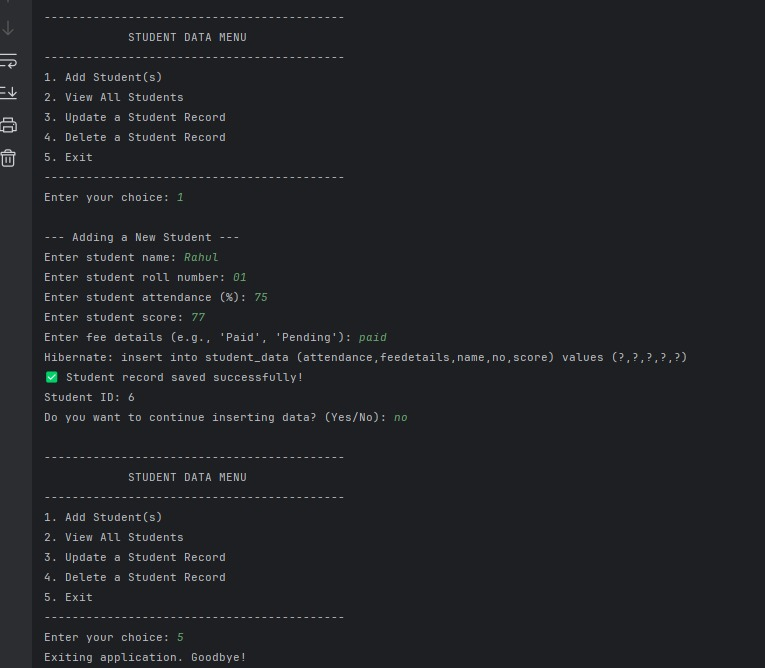
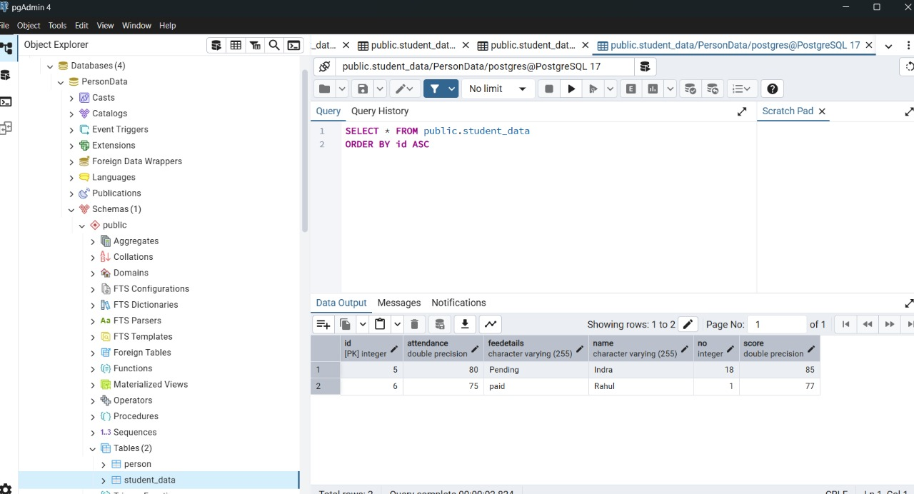

# Student Management Backend API

This is a simple backend application built with Java and Hibernate to perform basic CRUD (Create, Read, Update, Delete) operations on a student database. The project uses PostgreSQL as its database.

## 🚀 Features

* **Create:** Add new student records to the database.
* **Read:** View all student records stored in the database.
* **Update:** Modify existing student records (e.g., update attendance and score).
* **Delete:** Remove a student record from the database.

## 🛠️ Technologies Used

* **Java:** Core programming language.
* **Hibernate ORM:** Provides an object-relational mapping framework to interact with the database.
* **PostgreSQL:** The relational database used to store student data.
* **Maven:** Dependency management and build automation tool.
* **Git:** Version control system.

## 📦 Project Structure

The project follows a standard Maven directory structure.

* `src/main/java/com/indra/`: Contains the main application logic.
    * `Main.java`: The entry point of the application, containing the main menu and CRUD methods.
    * `Student.java`: The JPA Entity class representing the `Student` table in the database.
* `src/main/resources/`: Holds configuration files.
    * `hibernate.cfg.xml`: The Hibernate configuration file to connect to the PostgreSQL database.
* `pom.xml`: The Maven configuration file for project dependencies and build settings.

## 🔧 Getting Started

### Prerequisites

* Java JDK 21 or later
* Maven
* PostgreSQL database instance
* Git

### Setup

1.  **Clone the repository:**
    ```bash
    git clone [https://github.com/your-username/your-repository-name.git](https://github.com/your-username/your-repository-name.git)
    cd your-repository-name
    ```
    *Replace the URL and directory name with your own.*

2.  **Configure the database:**
    * Ensure you have a PostgreSQL database running.
    * Open `src/main/resources/hibernate.cfg.xml` and update the following properties with your database credentials:
        ```xml
        <property name="hibernate.connection.url">jdbc:postgresql://localhost:5432/PersonData</property>
        <property name="hibernate.connection.username">postgres</property>
        <property name="hibernate.connection.password">indra18</property>
        ```

3.  **Build the project:**
    ```bash
    mvn clean package
    ```

4.  **Run the application:**
    ```bash
    java -jar target/hibernate-crud-demo-1.0-SNAPSHOT.jar
    ```

## 🖥️ Sample Output

Here are some screenshots showcasing the application's functionality.

**1. Main Menu**


**2. Adding a New Student**


**3. Viewing All Students**


**4. Updating a Student Record**


**5.Viewing a updated Students**

---

*Developed by [K S INDRA KUMAR]*
